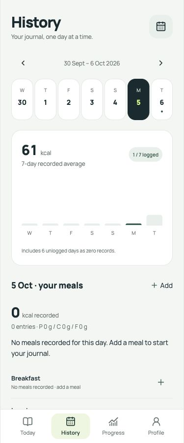
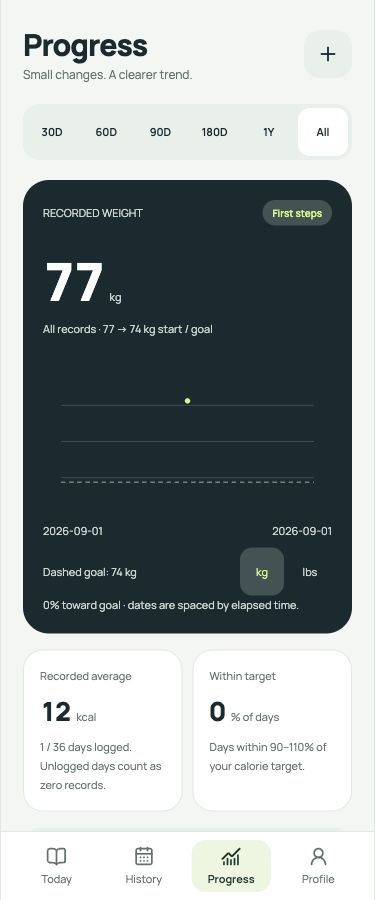
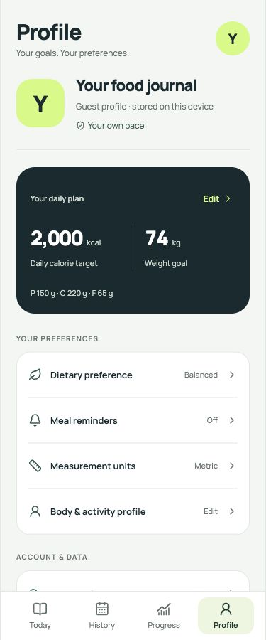

# Phone metric clipping fix

## Reported issue

Android screenshots showed clipped weight digits, cropped Profile calorie/weight targets, cramped Progress summary units, and clipped History calorie labels. All seven displays nested a small caption with an explicit 18–19px line height inside a larger numeric Text.

React Native's installed Android `CustomLineHeightSpan` adjusts whole-line font metrics. The small inline caption could therefore reduce the available height for the large digits. See [React Native text style documentation](https://reactnative.dev/docs/text-style-props).

## Correction

`src/components/MetricValue.tsx` renders the number and unit as sibling Text elements. Each keeps its own font metrics; the number has an adequate explicit line height and Android font padding. Baseline alignment, a real gap, wrapping and uncapped default system font scaling preserve readable units. Progress summary cards and Profile plan columns stack for narrow screens or large system text.

No nutrition values, profile data or calculation rules changed. Zero calories still correctly represent days without recorded meals.

## Verification on 6 October 2026

- **User confirmed on the original phone after reloading Expo: “All are fully visible.”**
- 71 tests passed, including separate number/unit rendering, zero preservation, scaling/wrapping, and adequate line-height checks at all seven reported metric locations.
- TypeScript and strict ESLint passed.
- Web, Android and iOS production exports passed.
- Browser visuals reviewed at 375px, 320px and landscape dimensions. No runtime console errors or warnings appeared during these checks.
- No physical Android device was attached to this Mac; device visual confirmation came from the user. Largest system font settings were not independently exercised on a physical device.

The following screenshots use isolated local guest QA data, not the user's account:

| History | Progress | Profile |
| --- | --- | --- |
|  |  |  |
