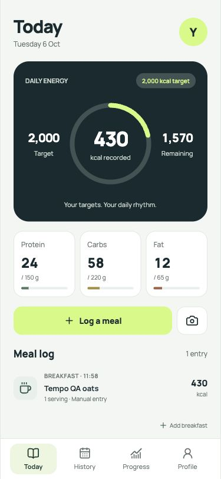
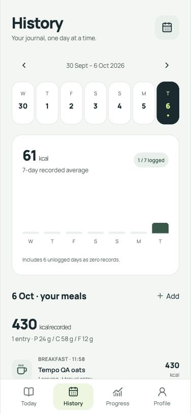
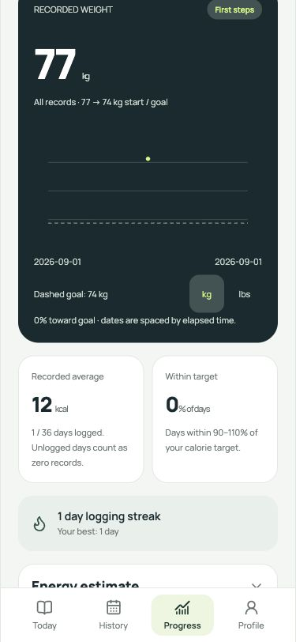
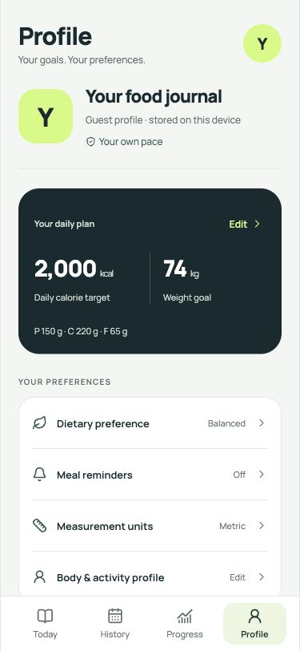

# Tempo implementation and verification

Verified on 6 October 2026 with Node 24.15.0 and Expo SDK 57.

## Interface

The approved second concept, Tempo, now covers Today, History, Progress and Profile. Manrope typography, paper surfaces, deep ink cards, forest accents and lime primary actions use shared theme tokens. Meal entry, weight entry, onboarding, authentication, notifications and camera controls follow the same theme.

The screens use actual journal data. Empty days remain empty; estimates retain their provenance. Profile separates targets, diet, reminders, units, account/sync and data management into focused sheets. Existing account isolation, cloud conflicts, backups and deletion confirmations remain available.

Screenshots use an isolated localhost guest profile with QA records:

| Today | History | Progress | Profile |
| --- | --- | --- | --- |
|  |  |  |  |

## Optimizations and corrections

- Public individual Lucide imports replace runtime barrel imports. Expo's reported web entry bundle decreased from approximately **4.0 MB to 1.9 MB** during this implementation. This measures JavaScript export size, not APK size.
- Journal entries are indexed once per change for day totals, scan counts and protein milestones.
- Saved meal search renders in batches of 40. A saved favorite recipe takes precedence over a recent meal with the same normalized name.
- Weight charts render at most 180 points for large histories, retaining endpoints and bucket extrema. The complete selected-period weigh-in list is virtualized.
- Calendar arithmetic handles leap years and month boundaries; UTC calendar coordinates keep chart spacing consistent through daylight-saving transitions.
- The All analytics period includes the earliest meal or weigh-in. History follows the shared date when returning from Today.
- Selecting the active meal-ideas preference cannot start a loading state that never completes. Settings validate before saving and prevent repeated in-flight submissions.
- EAS CLI is removed from app dependencies, eliminating 351 installed packages. Use the documented pinned `npx eas-cli@23.1.0` commands. Updated the compatible `source-map-js` dependency to 1.2.2.

## Verification

| Check | Result |
| --- | --- |
| `npm ci` | Passed with the updated lockfile |
| `npm test` | 69 passed; 6 added regression tests |
| `npm run typecheck` | Passed |
| `npx eslint src --no-cache --max-warnings 0` | Passed |
| `npx expo-doctor` | 21/21 checks passed |
| `EXPO_NO_CACHE=1 npx expo install --check` | Dependencies up to date |
| `npx deno check supabase/functions/nutrition-analysis/index.ts` | Passed |
| `EXPO_OFFLINE=1 npx expo export --platform all` | Web, Android and iOS passed |
| `git diff --check` | Passed |

The final exports report approximately 1.9 MB web entry JavaScript, 4.2 MB Android Hermes bytecode and 3.9 MB iOS Hermes bytecode. These are not installation package measurements.

Browser verification covered manual meal creation/editing and reload persistence, water increments, target validation/save, unit conversion/persistence, reminder validation/save with reminders disabled, calendar selection, week navigation, empty periods, All analytics, account-sheet navigation and meal-ideas error recovery. Phone-width and landscape layouts were reviewed; the desktop document had no horizontal overflow. The tested production preview emitted no console warnings or errors. No hosted database or real user records were changed by these tests.

## Remaining release checks

Native bundling does not verify a physical device. Test Android installation, font loading, keyboard/safe areas, large system text, camera/barcode/microphone permissions, notification scheduling, real Google/email sign-in, photo uploads and two-device cloud synchronization before a release. iPhone installation/signing remains a separate device setup step.

`npm audit` still reports **22 affected packages (19 high, 3 moderate)** through three transitive advisory groups:

- [braces nested-pattern denial of service](https://github.com/advisories/GHSA-vfj7-8cjw-p6xm): no patched release available in the registry at verification; affects the Metro/tooling chain.
- [node-forge signature verification](https://github.com/advisories/GHSA-86w9-cpqp-85rv): no patched release available at verification; used by Expo CLI code-signing tooling.
- [decode-uri-component malformed-input denial of service](https://github.com/advisories/GHSA-vcc3-ghjq-m6fr): patched 0.5.0 is ESM, while Expo Router's query-string 7 dependency requires the CommonJS callable API. A forced leaf override would break that contract; track an SDK-compatible upstream fix.

These findings remain unresolved. No forced SDK downgrade or unsupported dependency replacement was applied. Recheck advisories and Expo-compatible updates before release. This change publishes source only; it does not create a new APK, AAB or GitHub release.
