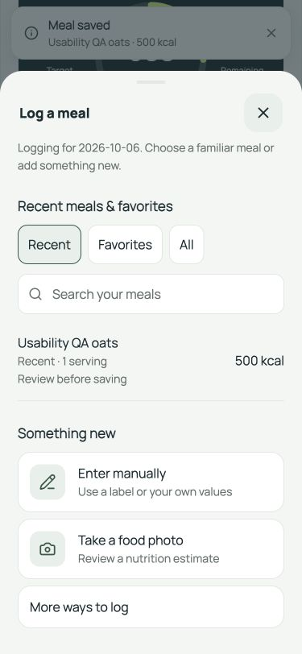
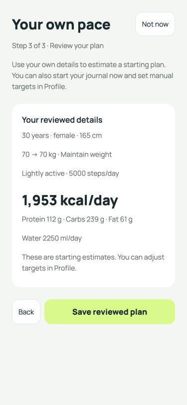
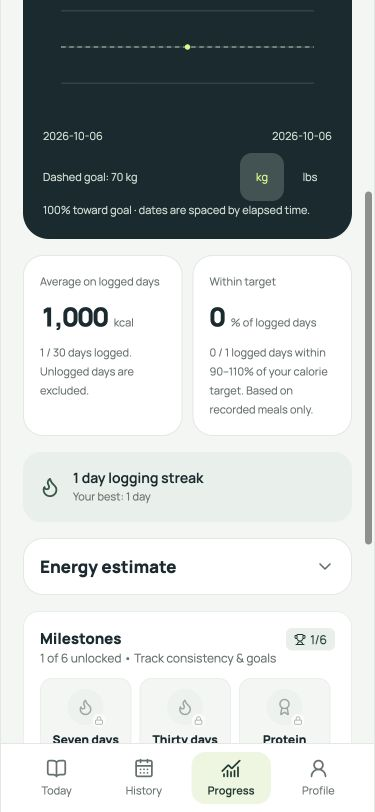

# Cal Tracker usability improvements

Implemented on 6 October 2026, preserving the Tempo design.

## 1. Recent meal access

The meal picker opens with recent meals first. Recent, Favorites and All filters,
search, and visible favorite labels help users find their meals. Selection opens
an editable review; it does not automatically log a meal. Favorite recipes retain
their saved nutrition and portion, even when a recent meal has the same name.
Manual entry and food photos remain visible below the list. Barcode, description,
meal ideas and weight logging remain available under “More ways to log.”

## 2. Onboarding

Three stages: Body details → Goals & activity → Review your plan. First-time
personal fields are empty, with example placeholders; calculation options require
explicit selection. Editing a completed profile retains saved values. Fields have
labels, blur validation and inline errors; Back retains entered details. Metric
and imperial conversion preserves blank fields and legitimate zero-inch heights.
Saving is guarded against duplicate taps and cannot close through Android Back
while pending. “Not now” allows journal access with existing starting targets;
manual target editing remains available in Profile. No profile or weigh-in is
saved until the reviewed plan is submitted. Skipping setup leaves it incomplete,
so it can be offered again on the next account activation.

## 3. Average clarity

History and Progress use average calories on days with meal entries. Target
percentage likewise uses logged days, with an explicit recorded-meal caveat.
Coverage stays separate, e.g. “1 / 7 logged.” No entries produces an unavailable
value (—), not a zero average. An explicit zero-calorie entry still counts as a
logged day. History omits bars for missing records and announces “Not logged.”
A logged day may contain incomplete intake; the app does not infer missing meals.

## Optimization evidence

- History and Progress reuse the provider's journal date index. Range changes
  traverse the selected dates rather than rescanning every meal.
- The closed picker unmounts; it initially renders six rows, with more on demand.
- Search names and favorite IDs are memoized; an empty query reuses the choices.
- Recent selection keeps the requested top results sorted instead of sorting all
  unique meal names. Regression tests compare it against the full stable sort.
- No new runtime dependencies.

Run `npm run benchmark:journal`. With 100,000 synthetic meals and a 30-day range,
a median of nine runs after two warmups measured:

| Helper | Before | After |
| --- | ---: | ---: |
| Recent selection | 46.649 ms | 11.061 ms |
| Range summary | 1.120 ms | 0.003 ms |

The summary measurement excludes index construction: the provider already builds
that index on record changes. These are desktop helper measurements, not phone
latency, APK size, or overall app speed claims.

## Verification

- 81 Node regression tests passed, including new onboarding, average and bounded
  recent-selection cases and existing account isolation/persistence tests.
- TypeScript, strict source ESLint, web export and Android/iOS Hermes exports passed.
- Isolated guest browser QA at 375 × 812: blank setup, inline errors, stage
  navigation, review, save, recent/favorite search, no-match feedback, saved-meal
  review and repeat save all verified. Recalculation reopened saved measurements.
- Two synthetic 500-kcal entries on one day produced a 1,000-kcal logged-day
  average and 1/7 coverage; an empty week displayed — and “Not logged.”
- Landscape navigation/recalculation checked at 812 × 375. No browser warning or
  error was captured in the checked flow.
- New screens have not yet been checked on a physical phone at maximum system
  text size or with TalkBack. Native exports verify bundling, not device behavior.

Screenshots use synthetic local guest data on a separate localhost port, not a
signed-in user's records. No database migration or live account write was needed.

